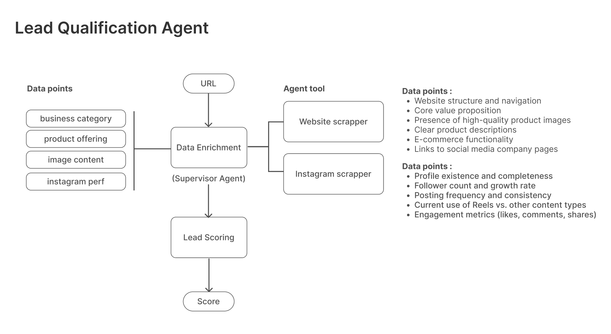

# Lead Qualification Agent

A powerful automated system for qualifying sales leads based on website and social media analysis.



## Overview

The Lead Qualification Agent is an AI-powered system designed to automate the identification of high-potential leads for ReelsMaker. The system analyzes business websites and Instagram profiles to determine their likelihood to convert and succeed with the product, helping sales teams prioritize their efforts on the most promising prospects.

## Installation

```bash
# Clone the repository
git clone https://github.com/your-organization/lead-qualification-agent.git

# Navigate to project directory
cd lead-qualification-agent

# Install dependencies
npm install
```

## Environment Setup

Create a `.env` file in the root directory with the following variables:

```
FIRECRAWL_API_KEY=your_firecrawl_api_key
OPENAI_API_KEY=your_openai_api_key
```

## Development

### Running in Development

```bash
npm run start
```

## Features

- Automatic data collection from websites and Instagram profiles
- Comprehensive analysis of online presence
- Cross-referencing between web and social media presence
- AI-powered evaluation of lead potential
- Detailed reporting on qualification criteria

## System Architecture

As shown in the architecture diagram, the system consists of two main components:

1. **Data Enrichment (Supervisor Agent)**

   - Takes a URL input (website or Instagram profile)
   - Determines appropriate scraper to use first
   - Cross-references between platforms when links are discovered

2. **Lead Scoring**
   - Evaluates collected data against qualification criteria
   - Generates a comprehensive lead score

## Data Collection Points

### Website Analysis

- Website structure and navigation
- Core value proposition
- Presence of high-quality product images
- Clear product descriptions
- E-commerce functionality
- Links to social media company pages

### Instagram Analysis

- Profile existence and completeness
- Follower count and growth rate
- Posting frequency and consistency
- Current use of Reels vs. other content types
- Engagement metrics (likes, comments, shares)

## Usage

```javascript
import { runDataEnrichment } from "./src/agents/lead-qualification";

// Run with a website URL
runDataEnrichment("https://example.com");

// Or run with an Instagram profile URL
runDataEnrichment("https://www.instagram.com/example_profile");
```

## Scoring System

Leads are evaluated on a 1-5 scale based on:

- Instagram Presence (30%)
- Website/Product Quality (40%)
- Business Category Fit (30%)

### Lead Classification

- **Hot Lead**: 4-5
- **Warm Lead**: 2.5-3.9
- **Cold Lead**: <2.5

## Potential Challenges and Considerations

### Data Accessibility and Quality

- Limited or private Instagram profiles
- Website access restrictions
- Incomplete or outdated business information
- Mitigation strategies for missing data points

### Industry Diversity

- Varied content requirements across industries
- Industry-specific qualification adjustments
- Calibration for emerging use cases
- Handling of edge cases and unique business models
